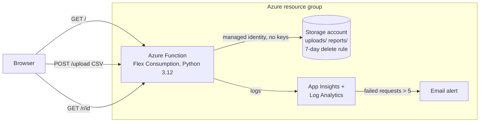

# Spending Checkup

Upload the CSV export from your bank and get back, in a few seconds:

1. **Spending by category**: groceries, dining, gas, shopping, bills, and so on.
2. **Recurring charges**: anything that shows up every month for about the same amount.
3. **Possible double charges**: the same merchant and amount within two days.

There's no account and no bank login, and your file and report are deleted automatically after 7 days.

This README is the one place where the project is explained. The code itself is kept short and has few comments.

---

## Architecture



One function does everything, one storage account holds everything, and there's nothing else to run.

| Azure service | What it does | Cost |
|---|---|---|
| Azure Functions (Flex Consumption) | Serves the page and analyzes the file | ~$0 (free monthly grant) |
| Storage account | `uploads/` and `reports/`, deleted after 7 days; also holds the deployment package | Fractions of a cent |
| App Insights + Log Analytics | Logs and one metric alert | $0 (free 5 GB/month, first 10 alert time series free) |
| Managed identity | Lets the function use storage with no keys | $0 |

### Request flow

1. **`GET /`**: `function_app.home` returns `src/upload.html`, a plain HTML form with no JavaScript.
2. **`POST /upload`**: `function_app.upload`:
   - checks the per-IP rate limit, that the file ends in `.csv`, and that it's no larger than 1 MB;
   - runs `analysis.analyze()` on the text;
   - picks a random ID (`secrets.token_urlsafe(16)`, 128 bits, so it can't be guessed);
   - saves the original to `uploads/<id>.csv` and the rendered HTML report to `reports/<id>.html`;
   - responds with `303 See Other` → `/r/<id>`, so the browser shows the report straight away.
3. **`GET /r/<id>`**: `function_app.view_report` returns the stored HTML, or a 404 once it has expired.
4. A **storage lifecycle rule** deletes anything under `uploads/` and `reports/` 7 days after it was written.
5. Every request is logged to App Insights automatically, and each analysis adds one line of its own.

`host.json` sets `routePrefix` to `""`, so the URLs are `/upload` rather than Azure's default `/api/upload`.

### Code layout

```
bootstrap.sh          one-time: Terraform state storage + GitHub OIDC login
infra/                Terraform: main, storage, function, monitoring (+ variables/outputs)
src/
  function_app.py     the three HTTP routes and storage access
  analysis.py         CSV → report dict (plain Python, no Azure imports)
  report.py           report dict → HTML
  upload.html         the upload page
  tests/              pytest unit tests
samples/              fake CSVs in Chase, Bank of America and Capital One layouts
.github/workflows/    ci.yml, deploy.yml
```

`analysis.py` doesn't import anything from Azure, so it can be tested without the cloud.

---

## How the analysis works

**Input: reading any bank's CSV.** Banks name their columns differently, so `analysis.parse()` maps them to one format:

| We need | Accepted column names |
|---|---|
| date | `Date`, `Posting Date`, `Transaction Date`, `Posted Date` (first one found) |
| description | `Description` |
| amount | `Amount` (negative = money out), **or** `Debit` + `Credit` (amount = credit − debit) |

Dates can be `MM/DD/YYYY`, `YYYY-MM-DD` or `MM/DD/YY`. `$` signs and thousands separators are removed from amounts. The detected layout, `amount` or `debit-credit`, is logged as the "bank format". If the file doesn't have these columns, `analyze()` raises `ValueError` and the user gets a friendly 400 page.

**Merchant names.** Card descriptions carry store numbers and IDs (`KROGER #512`, `SHELL OIL 88213`). `merchant()` uppercases the description and drops every word containing a digit, so `KROGER #512` and `KROGER #513` both become `KROGER`. Recurring and double-charge detection compare these cleaned names.

**Output: the report.**

| Section | How it's worked out |
|---|---|
| Spending by category | `CATEGORY_RULES` maps keywords to categories (`KROGER` → Groceries, `SHELL` → Gas). The first category with a matching keyword wins, so the more specific `UBER EATS` (Dining) is listed before `UBER` (Transport). Anything unmatched is "Other". Only money out is counted. |
| Recurring charges | The same merchant appears in 2+ different calendar months, and **every** charge is within 10% of the median amount. Netflix at $15.49 each month qualifies; Kroger at $92, $71 and $84 doesn't. |
| Possible double charges | The same merchant and the exact same amount within 2 days. Spending is sorted by date, and each charge is compared only with those in the next 2 days. |
| Totals | Money in, money out, and the biggest single purchase. |

To add a category or keyword, edit `CATEGORY_RULES` in `src/analysis.py`. There's no AI or machine learning here, just rules you can read and test.

**Known limits:** Gas bought twice at a similar price in different months counts as "recurring". That follows the spec's rule, and it's a reasonable prompt for the user to check. A refund followed by a re-charge of the same amount won't be flagged, because only money out is compared.

---

## Security and privacy

People are uploading their bank history, so this is the part to get right.

- **No keys or passwords anywhere.**
  - The storage account has `shared_access_key_enabled = false`, so account keys and SAS tokens don't work at all.
  - The function reaches storage with its **system-assigned managed identity** through `DefaultAzureCredential`. The Functions host's own storage (`AzureWebJobsStorage__accountName`) and the deployment package container use the same identity.
  - Terraform uses Entra ID for storage too (`storage_use_azuread = true`, backend `use_azuread_auth = true`).
  - GitHub Actions logs in with **OIDC**: Azure trusts a short-lived token that GitHub issues only to this repo's `plan` and `production` environments. There's no client secret to leak.
- **Nothing public.** Blob public access is off, and every read goes through the function. A report link is a random 128-bit ID that stops working after 7 days.
- **Short-lived data.** A lifecycle rule deletes uploads and reports 7 days after they're written. The log line records only the row count, duration and bank format (`analysis done rows=18 ms=3 format=amount`), never descriptions or amounts. Descriptions shown in reports are HTML-escaped.
- **Abuse limits.**
  - Files must be `.csv` and are capped at 1 MB. Only 1 MB + 1 byte is read before the size check.
  - Each IP is limited to 10 uploads per minute. The counter lives in memory on each instance, so it's best-effort: it stops casual spam but resets when an instance restarts, and each instance has its own count. A shared limiter (for example Azure Front Door WAF rate limiting) would be the next step.
- **Least privilege.**
  - The GitHub identity has rights on **this one resource group only**: Contributor, plus Role Based Access Control Administrator so Terraform can grant the function its storage role. It also has Storage Blob Data Contributor on the Terraform state account.
  - The function has **Storage Blob Data Owner on its own storage account**. The spec wanted access limited to the two containers. That isn't possible with one identity and one account, because the Functions runtime needs account-wide blob access for its own bookkeeping (leases, deployment package), and Microsoft documents Data Owner for that. To make it strict, put host storage in a second account and scope the app's role to `uploads/` and `reports/` (see stretch goals).
  - The `tfplan` artifact that passes from the plan job to the apply job can contain the App Insights connection string, so it's kept for only 1 day.

---

## Terraform and CI/CD

### Infrastructure (`infra/`)

| File | Contents |
|---|---|
| `main.tf` | Providers, remote state backend, the existing resource group (created by `bootstrap.sh`), and a random 6-character suffix so global names are unique |
| `storage.tf` | Storage account (keys off, public off, TLS 1.2), the `uploads`, `reports` and `deploy` containers, and the 7-day lifecycle rule |
| `function.tf` | Flex Consumption plan (`FC1`), the Python 3.12 function app with a system-assigned identity, and its storage role |
| `monitoring.tf` | Log Analytics (30-day retention, 0.1 GB/day cap), App Insights, the email action group, the failed-requests alert, and the $1 budget |

The resource group comes from `bootstrap.sh` rather than Terraform, because the deploy identity's permissions are scoped to it and it has to exist first.

### Workflows

| Workflow | Runs on | What it does |
|---|---|---|
| `ci.yml` | Every pull request (and at the start of every deploy) | `pytest`, `terraform fmt -check`, `terraform validate` |
| `deploy.yml` | Merge to `main` | **plan** job (environment `plan`): `terraform plan` → saved plan artifact. **apply** job (environment `production`, waits for **your approval**): `terraform apply` of that exact plan → zip `src/` and deploy it with remote build (retried up to 5 times, a minute apart) → smoke test |

The **approval gate** is GitHub's "required reviewers" setting on the `production` environment. The Azure federated credential trusts the environment by name, so skipping the gate means no Azure login.

**Why the code deploy retries:** the function app uploads its own code package to storage using its managed identity. On the very first deploy, Terraform grants that storage role only seconds before the upload, and a new Azure role can take several minutes to take effect, so the first attempt can fail with a 403. Retrying once a minute covers the delay. Later deploys succeed on the first attempt.

**Why `AzureWebJobsStorage = ""`:** the Terraform provider always writes a key-style `AzureWebJobsStorage` connection string on Flex apps. With identity auth it has an empty key, and the Functions host prefers it over `AzureWebJobsStorage__accountName`. Because account keys are off, the host's own storage calls then fail with 403, and every deploy's final trigger-sync step fails with a 500. Setting it to an empty string in `app_settings` overrides the provider's value, and the host falls back to the managed identity. The catch: the provider doesn't read this setting back, so every `terraform plan` shows a harmless in-place update to the function app.

The **smoke test** uploads `samples/chase.csv` to the live site, follows the redirect, and checks that the report contains "Groceries" and the Kroger double charge. It retries for about 2 minutes to cover a cold start.

---

## Setup

Prerequisites: the Azure CLI (`az login` done), the GitHub CLI (`gh auth login` done), a GitHub repository for this code, and permission to create app registrations in your Entra tenant.

1. **Bootstrap (once):**
   ```sh
   REPO=your-user/spending-checkup ./bootstrap.sh
   ```
   Optional: `RG`, `LOCATION` (default `eastus`), `APP_NAME`, `STATE_ACCOUNT`. The script is safe to re-run. It:
   - registers the resource providers (Terraform has `resource_provider_registrations = "none"`, because the deploy identity can't register providers subscription-wide);
   - creates the resource group;
   - creates the keyless Terraform state storage account and its `tfstate` container;
   - creates the GitHub app registration with federated credentials for the `plan` and `production` environments;
   - assigns the roles above;
   - prints the values you need in the next step.
2. **GitHub settings:**
   - Under Settings → Environments, create `plan` and `production`, and add yourself as a required reviewer on `production`.
   - Under Settings → Secrets and variables → Actions → **Variables**, add the variables the script printed: `AZURE_CLIENT_ID`, `AZURE_TENANT_ID`, `AZURE_SUBSCRIPTION_ID`, `AZURE_RESOURCE_GROUP` and `TF_STATE_ACCOUNT`. Then, on the **Secrets** tab, add `ALERT_EMAIL`.

   The variables aren't secrets. They're only IDs that say *which* tenant, subscription and app to use; they don't grant access, because Azure accepts a login only with a short-lived OIDC token that GitHub issues to this repo's `plan` and `production` environments. Variables are printed unmasked in workflow logs, though, and logs on a public repo are public. So your email goes in a secret, where GitHub masks it.
3. **Push to `main`**, approve the `production` job, and open the URL in the job summary.

## Local development

```sh
uv run --no-project --with pytest pytest     # or: pip install pytest && pytest
```

`pytest.ini` points pytest at `src/`. The tests run the analysis on each sample CSV and check column mapping, categories, recurring charges, double charges, totals, rejection of non-bank files, and HTML escaping.

To run the whole function locally, install [Azure Functions Core Tools](https://learn.microsoft.com/azure/azure-functions/functions-run-local), sign in with `az login`, give yourself *Storage Blob Data Contributor* on a storage account, and create `src/local.settings.json`:

```json
{
  "IsEncrypted": false,
  "Values": {
    "FUNCTIONS_WORKER_RUNTIME": "python",
    "AzureWebJobsStorage": "UseDevelopmentStorage=true",
    "STORAGE_URL": "https://<your-account>.blob.core.windows.net/"
  }
}
```

`UseDevelopmentStorage=true` needs [Azurite](https://learn.microsoft.com/azure/storage/common/storage-use-azurite) running for the Functions host. Then run `cd src && func start` and open http://localhost:7071/. `DefaultAzureCredential` picks up your `az login`. The `uploads` and `reports` containers must already exist in that account.

---

## Monitoring and cost

- **Logs:** each analysis writes `analysis done rows=<n> ms=<t> format=<amount|debit-credit>`. Find them in App Insights → Logs:
  ```kusto
  traces | where message startswith "analysis done"
  ```
- **Alert:** every 15 minutes, if more than 5 requests failed, an email goes to `ALERT_EMAIL`. A request counts as failed when the function crashes. Friendly 4xx answers, such as a bad CSV or the rate limit, aren't failures.
  - The spec asked for an alert when the error *rate* goes above 5%. That needs a log search alert, which costs about $0.50/month. A metric alert can't divide two numbers, but it's free for the first 10 time series, so this project uses a fixed count instead.
- **Cost: $0/month in practice.** Every piece sits inside a free allowance:
  - **Functions:** Flex Consumption's monthly free grant, with no always-ready instances, so nothing runs while it's idle.
  - **Alert and emails:** one metric alert time series, and alert emails are free too.
  - **Logs:** Log Analytics is capped at 0.1 GB/day, about 3 GB/month, under the free 5 GB. That allowance is per *billing account*, so other projects' workspaces (for example `say-hi`) share it.
  - **Storage:** both accounts hold a few KB, so they cost fractions of a cent, which usually rounds to $0.00 on the bill.
- **Budget:** a **$1 budget** emails you when actual *or forecast* spend passes 1% of it, which means the first cent.
- **Azure has no hard spending cap on pay-as-you-go.** A budget only warns you; it doesn't stop anything. A hard stop at $0 is only available on subscriptions with a spending limit (the Azure free account, Azure for Students, Visual Studio credits). If the alert ever fires, run `terraform destroy`, or delete the resource group.

---

## Stretch goals

- Put the Functions host storage in a second account, so the app identity's data role can be scoped to just `uploads/` and `reports/`.
- Private endpoint for storage, with the function joined to a VNet (about $8/month).
- Azure Policy rules that block public storage or resources outside one region.
- A shared rate limit (Front Door WAF) instead of the per-instance one.
- Let people email themselves the report using Azure Communication Services.

## Resume bullets

Measure first, then fill the brackets with real numbers (the `ms=` log line gives you the timing):

1. Built a serverless spending analyzer on Azure Functions that turns a bank CSV export into a category, subscription, and double-charge report in under [X] seconds for [N]-row files.
2. Protected uploaded financial data with managed identity (no stored keys), private storage, and automatic 7-day deletion, running at $0/month.
3. Deployed with Terraform and GitHub Actions (OIDC, approval gate, smoke test), rebuilding the full environment in [X] minutes.
